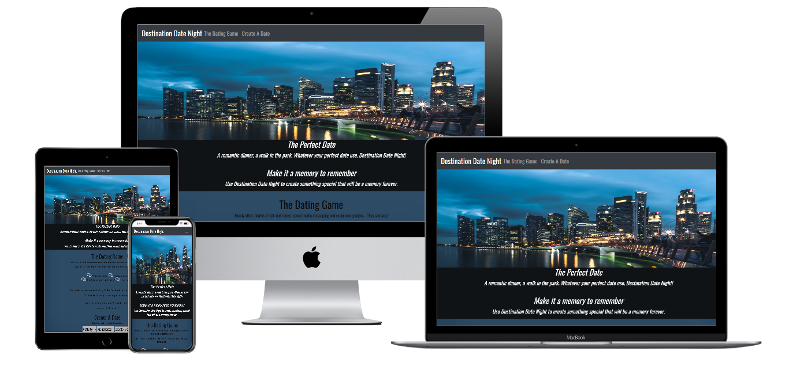

# Destination Date Night 

## Aim

To create a fun interactive front end website that responds accordingly to the users actions. This website is designed so users can create their 'Perfect Date' by selecting specified dropdown criteria and clicking the button. The outcome will reveal their chosen perfect date.

Technologies to be used in the project are HTML/CSS/Javascript with optional framework and API.

## Purpose

The owner of Destination Date Night wants to create a fun website that allows users to interact using differing functionality. The user will select specified criteria from the two dropdowns then click a button, this will in turn produce an outcome. The user can review this outcome in order to make a decision on where to go on their date.

It is hoped that the users will find the website to be a fun and interesting way to gather ideas for a date. By using the search criteria offered and the results the site returns the user can plan a date that will suit their individual needs.

## UX

## User stories

### Owner

The owner would like users of the website to - 

-  Interact with the site to find their perfect date.

-  Enjoy the site and use it as a useful tool to find ideas.

-  Find the site is fun and simple to use.

The owner would like the website design - 

- To be sultry looking with colors and a theme that portrays this.

- To have a hero image that creates mystery and excitment.

- To be one page with two easy to navigate sections. Section 1 - The Dating Game and Section 2 - Create A Date.

- To have a navigation bar that links to the sections when clicked.

- To house dropdowns with specified criteria that can be selected.

- To have a button that when clicked reveals and output.

- To use the Google Maps JS API to have a marker on the destinations so the user can click to learn more.

- To have a footer containing social media icons that link to other sites.

- To include company contact details.

The site will -

1. Have three main sections, the first a hero image with text enticing the user to look further, the second will be a querky narrative explaining the site, the third will house the interactivity.
2. Explain the websites outcome by instructing how it is to be used.
3. Based on criteria selected, output a 'date' which will be in text form. Also the Google Maps JS API will host static markers where the user, based on their criteria selection can click on the specific 'City' marker where the date location and direct link to the website will be. 
4. Link to external social media sites.
5. Will have contact details - location and email address of Destination Date Night HQ.

### Potential client

As a potential user of this site, the user would -

 - Discover what Destination Date Night is, how it works and what its output is.
 - See a brand that draws users in and then after user interaction entices users to find out more.
 - Find its USP (unique selling point) is its uniqueness. During initial research the owner was unaware of a site like this. 
 - Understand what functionalities it offers.
 - Be encouraged to find out more about the brand and company by clicking links to social media pages.
 - Be able to contact Destination Date Night with questions (via a contact form direct from site, via a link to social media, or telephone).

## 5 Planes

### Strategy

- Destination Date Night is currently a simple fun interactive website. It allows simple usage to provide a fun factor for idea gathering. It features the 3 core languages of web development HTML, CSS and Javascript and Google Maps JS API as a prime feature. 

- There is a clear brand (although no logo as of yet) and a company philosophy of "Making Memories" whilst incorporating this the fun factor was required to be a major part of the content.

- Destination Date Night has the potential of not only being a popular fun idea gathering site for current users, it potentially has the power to become a thriving business site. By adding a few addtional features to the site and marketing it well, Destination Date night could be something with a decent ROI.

- During research I was unable to find any other sites that had the same 'making memories' concept within a simple game like page making Destination Date Night a niche. 

### Scope 

- The site was developed with simplicity in mind. It was scoped to provide a straight forward approach, the user was to click a few dropdowns and a button and the site would produce an outcome. The Google Map JS API was to be the prime feature.

### Structure

- Destination Date Night's site structure was to be simple. A one page site that draws in the user with a straightforward scroll. An eye-catching hero image and little enticing text to invite the user to see more.  

- The site has 5 areas, Navbar, Hero Image, 2 main sections with descriptive text and interactivity and a footer. It is hoped the user would be drawn into the site with by the brand design, color, image and text.

### Skeleton

*#### Wireframes*

Desktop and Mobile wireframes were created to demonstrate the initial idea for the site. They were created using [Balsamiq](https://balsamiq.com/wireframes/).

##### Mobile

The [Mobile](assets/wireframes/destination-date-night-mobile.png) wireframe shows a view were all of the features sit on top of each other in a responsive manner. For example the navbar utilises the hamburger icon and is positioned on the right, the criteria dropdowns, button are central. The Google Map is the main sections focal point and the footer information sits underneath.

##### Desktop

The [Desktop](assets/wireframes/destination-date-night-desktop.png) wireframe gives a more spaced look, the navbar here sits across the top of the page, text, interactivity dropdowns and Google Map all sit on top as the design is the same as mobile.

There are a few slight adjustments from the wireframes this was due mainly to styling aesthetics. Having text screen wide made the site look bulky and messy it needed some blank areas to clean it up. However the desktop site needed the Google map to be screen wide to keep in users eyeline.

### Surface 

Colors and fonts where important to the website to promote a sultry, tempting, feel good reaction.
The site's "evening" colors of greys and black where selected to enhance this feeling.

Users will see that Destination Date Night is aiming for a luxurious look. The Hero image provides that instant attraction on site opening.

## Features 

### Existing Features

One webpage page: The site uses just one page with a simple scroll movement this will provide ease of use. 

Navbar: The navbar is responsive and links to both of the main sections The Dating Game and Create A Date, simple navigation was a key factor.

Dropdowns: The two dropdowns have specific criteria built in, a Date Type and a Date Location. The dropdown when clicked reveals specified criteria to select.

Button: The button when clicked reveals the date chosen in text format this provides a neat feature to the site.

Google Maps:  The Google Map API adds value by showcasing the date destinations with a marker.

Hyperlink: There is a hyperlink at the bottom of the map to take people back to the site top.

Social Media Links: Social Media icons are positioned in the footer, so to allow users to visit other Destination Date Night media.

### Future Features

Future features of Destination Date Night could include - 

- Having a larger criteria library and more diverse date ideas.
- An image gallery of past dates at various locations.
- Testimonials and success stories from users of the site.
- A Destination Date Night blog.
- Being able to call the chosen date location direct from the site.
- An area to check the weather at the chosen location, with 1 day or 10 day outlook.
- An e commerce shop where users could order branded Destination Date Night merchandise.

## Technologies 

#### Technologies
- HTML
- CSS
- Javascript

#### Frameworks
- [Bootstrap](https://getbootstrap.com/)

#### Text Editor
- [Gitpod](https://gitpod.io/)

#### Version Control
- Git

#### Hosting Platform
- [Github](https://github.com/)

#### Developer Tools
- Google Dev Tools

#### API
- [Google Maps JS API](https://developers.google.com/maps/documentation/javascript/overview)

#### Validation sites
- [W3C Markup Validation](https://validator.w3.org/)
- [Jshint](https://jshint.com/)

## Testing

Various testing was undertaken during the creation of this site including various devices checks. Also the W3C Markup Validator, validation check was ongoing throughout the project development.

Below are a few issues and bugs found during the development stages.

#### Issue 1

Footer 
- A couple of issues with the footer postioning during development nothing to difficult to resolve. The main one being the Font Awesome Instragam icon square  - this just would not load. All other social icons in square format worked and displayed well it was just this one. Eventually the alternative non square icon was tested and this displayed correctly, therefore kept this icon on the site.

#### Issue 2

Navbar
- First issue - the Navbar was built following Bootstrap Navbar Documentation, however the navbar hamburger was required on the right instead of left on mobiles. After reviewing Bootstrap documentation again the 'navbar-brand' had not been added to the nav html, this bug fixed. The entire 'a' class was moved to above the 'button', this changed the position of the hamburger on mobiles.
- Secondly the .navbar-brand would not line up correctly. After a few tests in Google Dev tools, it is believed a margin needed a fix. A 0px margin-right and margin-left was added to the CSS .navbar-brand class and that fixed the issue.

#### Issue 3

Background Image
- The background image wasn't responding well to responsive design. After googling it was found a Hero Image would suit better. At first the inital image that was chosen wouldn't sit correctly, so another image was selected. This seemed to fit correctly on first attempt. 
After some testing the footer and the background to the "Perfect Date" text didnt align with the hero images. In CSS the width of the images had been set to 1600px after googling for a suitable resolution for a hero image. Once this had been amended to 100% everything lined up correctly.

#### Issue 4

IPAD
- The challenge was getting the IPAD to be responsive. Whilst testing in Google Dev Tools using the size markers and the responsive dropdown at the top, a tablet at 768 x 768 worked and was aligned. However when the IPAD template was used the size changed and was out of line.
Testing was done to fix this but it was unrectified. However by the end of the project this somehow fixed itself. The thought on this fix is possibly due to the amendment of the hero image size as discussed above. 

#### Issue 5

If statement 
- The first attempt at writing an 'if' statement didnt work. Initially it was written using the == operator. After googling the difference between == and === operators, it was realised this was the error. The code needed the === operator so it would return true as both Dinner and Leeds needed to be true. However it still didnt work.
- Finally the error was found in a } symbol on line 13 in the main.js file - this was placed in a line of code that closed the function before it managed to filter through the data. Once the closing } was positioned correctly onto line 58 in the main.js file the function worked and the buttons could be clicked and the date text was revealed.

#### Issue 6

Google Map API 
- Setting up the Google Map created errors in the console. After trying to correct it by re reading Google Maps JS API documentation it was found the issue was with Application Restriction section specifically the HTTP Referrer in the main Credentials area of the Google Cloud Platform.
  In order to rectify this various links where added here. The github live site link, the gitpod workspace link and two wildcard links. Finally the map worked.
- During last testing sessions the Google Map was very temperamental, very slow in showing up and sometimes not showing at all. On last test the map worked.

#### Issue 7

Alert Box 
- In the Potential User section, there was to be a contact form implemented. As this was not implemented, as a possible workaround the idea of an alert box was thought to be an option.
  An alert box was created using HTML and JS and tested. The alert box showed when the email address in the footer was clicked. The alert box worked perfectly on a desktop however on the mobile there was no pop up alert. Also aesthetically the button looked ugly and not suited for the sites look, therefore this was removed.
  [alert box image](assets/images/alert-box-image-capture.jpg)

#### Issue 8

Validation sites
- When validating the code for HTML and CSS errors where found and rectified. Mostly simple errors and typos.
- JShint for JS validation found there where 14 warnings, however many was of the same error. Unfortunately a fix wasnt implemented due to lack of understanding on how to resolve them and to time constraints. 
  Here are the errors 
  - *'let' is available in ES6 (use 'esversion: 6') or Mozilla JS extensions (use moz).*
  - *'template literal syntax' is only available in ES6 (use 'esversion: 6').*
  - *'const' is available in ES6 (use 'esversion: 6') or Mozilla JS extensions (use moz).*
  - *'Invalid meta property: 'new.maps'.*

### Browsers tested

- Chrome: Using Google Developer Tools - Chrome was used for testing on Laptop, Tablet and Android devices.

- Safari: Safari wasn't used for testing on an I phone or Mac, due to not having access to these type of devices.

### Devices tested

On final testing session the below devices where used here are the outcomes.

Mobile:
- Android - Samsung Galaxy A40 - Outcome: Site works perfectly. No bugs found. All is responsive.
- Android - Samsung Galaxy A20 - Outcome: Site works perfectly. No bugs found. All is responsive.
- Android - Samsung Galaxy S10 - Outcome: Site works perfectly. No bugs found. All is responsive.

Laptop:
- Toshiba Satellite C850 - Outcome: Site works perfectly. No bugs found. All is responsive. 

## Evaluation

- The owner is pleased with the design and development of this site. It has all the basic requirements of a functional website and meets the project criteria.
- The site definitely has room for future interactive activity, functionality and imagery.
- During later stages of development it was realised some of the testing should have been branched off to show the workings. Something the owner will keep in mind for next time.
- All testing was manual, the use of the Jasmine framework was not used. Again somthing to consider in the future, especially if additional functionalities are added at a later stage.
- In User Stories in 'the site will' section it was stated - *Also the Google Maps JS API will host static markers where the user, based on their criteria selection can click on the specific 'City' marker where the date location and direct link to the website will be.* However this idea and functionality was not applied, primarily due to not having a full understanding but also due to time contraints. 
  It wasnt feasible to add the marker functionality to the site just so it had something that was interactive when the developer wasn't confident in their abilities to be able to explain the workings and possibly only having one marker that worked. Therefore it was decided to develop the site with only one static marker on the map that pre sat on opening and when hovered over on a laptop popped up text.
  Once the developer has a better understanding in place this feature will be first to be added. Being able to click the marker of the date location and it provide at minimum the name of the date location and a link to it was one of the prime functionalities during inception.
- In Potential Client section, it was stated the user could *contact Destination Date Night with questions (via a contact form direct from site)*, a form wasnt implemented again due to time constraints. A workaround was thought about and tested by way of an alert box - as explained in Testing section - Issue 7. When this feature is implemented EmailJS is a possible tool to use.
- It was found during the last stages of building this site that there was actually a site slightly like Destination Date Night. It was found when adding the final destination criteria to the site. The owner was disheartened and discouraged on the finding after the hard work and thought put in to design this site. 
  Here is the similar site [Designmynight](https://www.designmynight.com/)

## Deployment

In order to deploy the project to [GitHub](https://github.com/) Pages from its GitHub repository, follow the below steps:

1. On menu bar, select the 'Settings' tab.
2. Here, Scroll down to the GitHub Pages section.
3. In 'Source' click the drop-down menu labelled None, click and select Master Branch.
4. Once selected, Master Branch page will automatically refresh, the website will now be deployed.
5. Head back to the GitHub Pages section here you can retrieve the link of the deployed website.

If you want to run this project locally, we must clone the project for Github:

1. Under the repository name, click the green "Clone or download" button on the right.
2. A dropdown 'Clone with HTTPs' section appears, here copy the clone URL for the repository.
3. In your local IDE open Git Bash.
4. Change the current working directory to the location where you want the cloned directory to be made.
6. Type 'git clone' and paste the URL you copied.

- Example: git clone  = https://vmblakelock.github.io/destination-date-night/

7. Press Enter. Your local clone is now created.

## Credits and References

Personal credits go out to the following people
- Spencer Barriball my mentor - for the assistance and guidance in the building of Javascript functions, commented accordingly within the code.

Tutor Support
- Tim from tutor support advised on a security issue I had during the creation of my Google Map JS API. I was getting emails from Google saying my site was possibly being compromised. This was due to the API key being visible.
Tim recommended that this maybe something to try to stop the emails and sent me a link to the "keyHelper" created by Matt Rudge of Code Institute that would obfuscate my API key. I thought this was a great thing due to the added security to my site - therefore I decided to add it into my JS file on the project. [githubkeyhelper](https://github.com/Code-Institute-Org/key-helper)

Web References
- [codeahoy](https://codeahoy.com/javascript/2019/10/12/==-vs-===-in-javascript/#:~:text=The%20difference%20between%20%3D%3D%20and%20%3D%3D%3D%20is%20that%3A,the%20two%20variables%20being%20compared)
    - The Codahoy website 2019 references: *' === does not do any type conversion (coercion) and returns true only if both values and types are identical for the two variables being compared.'*

#### Websites reviewed

Websites reviewed and used during the creation of this project.

- [Markdownguide](https://www.markdownguide.org/basic-syntax/)
  - Used this website to refresh knowledge on how to use Markdown.

- [Google Fonts](https://www.fonts.google.com/basic-syntax/)
  - Used for choosing inital font for css @import

- [W3Schools](https://www.w3schools.com/basic-syntax/)
  - Reviewed and used frequently throughout the design of this project.

- [W3C Markup Validation](https://validator.w3.org/)
  - Validation testing of HTML and CSS.

- [Jshint](https://jshint.com/)
  - Validation testing of Javascript.
  
- [StackOverflow](https://stackoverflow.com/)
  - Various research throughout.

- [Bootstrap](https://getbootstrap.com/)
  - Documentation on Navbar and Modals.

- [Balsamiq](https://balsamiq.com/)
  - Used for creating the wireframes.

 

## Acknowledgements

The Slack community for assisting me on my journey through this website.

A fantastic mentor for providing excellent guidance and expertise to allow me to be confident in developing this site.

Tutor support for my questions when I need a little extra assistance.

The developers own perserverance during a tough 6 months of a global pandemic resulting in lockdown, additional workload, changes in family commitments, illness and the unknown.

*created for education purposes only*

